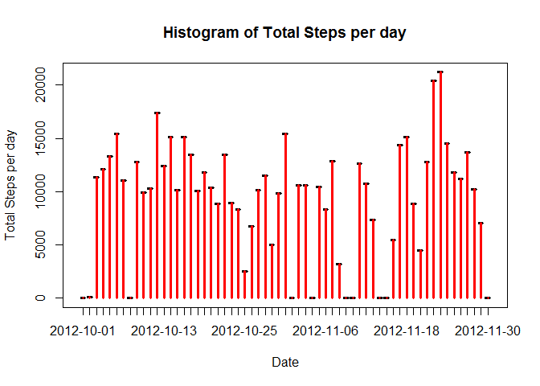
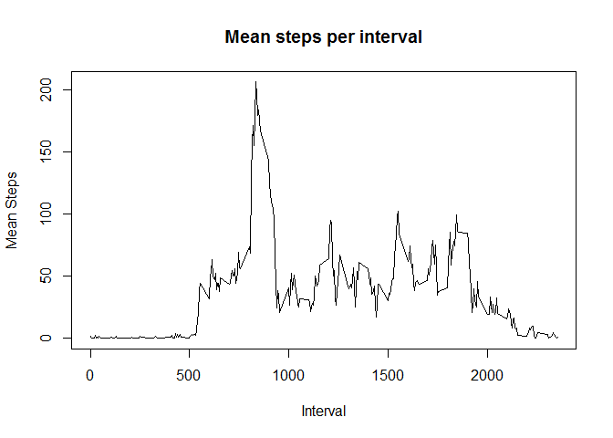
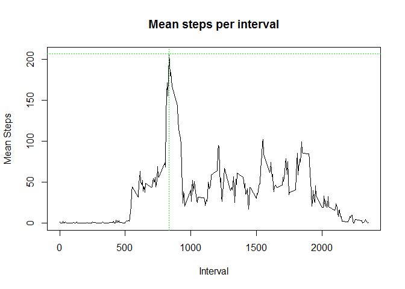
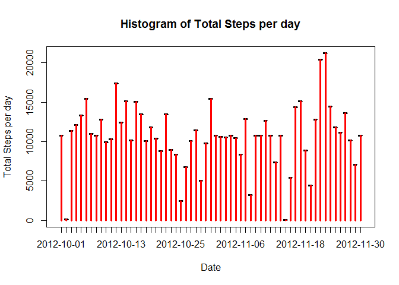
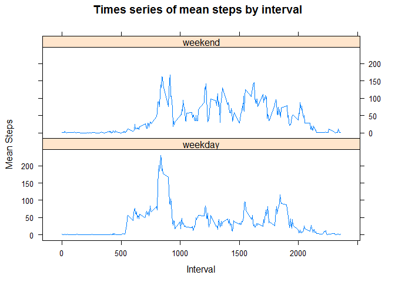

# Reproducible Research: Peer Assessment 1


***
***

## Loading and preprocessing the data
### 1. Load the data
#### - reads csv into dataframe "df"

```r
# assume original data source is in same folder
df <- read.csv("./activity.csv")
```

### 2. Process/transform the data
#### - adds a datetime variable by concatenating date and interval

```r
# creates datetime field
interval_char <- formatC(df$interval, width = 4, format = "d", flag = "0")
datetime_char <- paste(df$date, interval_char)
df$datetime <- strptime(datetime_char, format = "%Y-%m-%d %H%M")
```
#### - resulting dataframe "df"

```r
str(df)
```

```
## 'data.frame':	17568 obs. of  4 variables:
##  $ steps   : int  NA NA NA NA NA NA NA NA NA NA ...
##  $ date    : Factor w/ 61 levels "2012-10-01","2012-10-02",..: 1 1 1 1 1 1 1 1 1 1 ...
##  $ interval: int  0 5 10 15 20 25 30 35 40 45 ...
##  $ datetime: POSIXlt, format: "2012-10-01 00:00:00" "2012-10-01 00:05:00" ...
```

***
***

## What is mean total number of steps taken per day?
### 1. Make a histogram of the total number of steps taken each day
#### - aggregates total no. of steps per day

```r
# uses the plyr package
library(plyr)
# aggregate the total number of steps per day (while removing NA values)
steps_per_day <- ddply(df, .(date), summarise, total.steps.per.day = sum(steps, 
    na.rm = TRUE))
```
#### - make a histogram

```r
# histogram
plot(steps_per_day$date, steps_per_day$total.steps.per.day, type = "n", main = "Histogram of Total Steps per day", 
    xlab = "Date", ylab = "Total Steps per day")
lines(steps_per_day$date, steps_per_day$total.steps.per.day, type = "h", col = "red", 
    lwd = "3")
```

 

### 2. Calculate and report the mean and median total number of steps taken per day
#### - compute mean and median steps per day

```r
# aggregate mean/median of total steps per day (while removing NA values)
mean_total_steps_per_day <- mean(steps_per_day$total.steps.per.day, na.rm = TRUE)
median_total_steps_per_day <- median(steps_per_day$total.steps.per.day, na.rm = TRUE)
```
#### - mean steps per day is 9354.2295082, while median steps per day is 10395

***
***

## What is the average daily activity pattern?
### 1. Make a time series plot of the 5-minute interval (x-axis) and the average number of steps taken, averaged across all days (y-axis)
#### - aggregate mean number of steps across all days by each interval (while removing NA values)

```r
# aggregate by mean steps
mean_steps_per_interval <- ddply(df, .(interval), summarise, mean.steps = mean(steps, 
    na.rm = TRUE))
```
#### - plot time series

```r
# plot time series of mean steps by interval
plot(mean_steps_per_interval$interval, mean_steps_per_interval$mean.steps, type = "l", 
    main = "Mean steps per interval", xlab = "Interval", ylab = "Mean Steps")
```

 

### 2. Which 5-minute interval, on average across all the days in the dataset, contains the maximum number of steps?
#### - find interval with maximum averaged steps

```r
max_steps <- max(mean_steps_per_interval$mean.steps)
interval_max <- mean_steps_per_interval[which.max(mean_steps_per_interval$mean.steps), 
    1]
```
#### - interval at 835 contains the maximum number of steps (206.1698113 steps)

```r
# plot point of max steps in same histogram
plot(mean_steps_per_interval$interval, mean_steps_per_interval$mean.steps, type = "l", 
    main = "Mean steps per interval", xlab = "Interval", ylab = "Mean Steps")
abline(h = max_steps, col = "green", lty = 3)
abline(v = interval_max, col = "green", lty = 3)
```

 

***
***

## Imputing missing values
### 1. Calculate and report the total number of missing values in the dataset
#### - count number of NA in each column (steps, date, interval)

```r
number_steps_na <- length(df[is.na(df$steps), 1])
number_date_na <- length(df[is.na(df$date), 2])
number_interval_na <- length(df[is.na(df$interval), 3])
```
#### - there are 2304 NA values in "steps" column, while 0 NA values in "date" column and 0 NA values in "interval" column

### 2. Strategy to fill in missing values
#### - use mean steps in each interval to impute missing

```r
# merge mean steps per interval
df_new <- merge(df, mean_steps_per_interval, by = "interval", all.x = TRUE, 
    sort = FALSE)
# if NA then use mean steps
df_new$new.steps <- ifelse(is.na(df_new$steps), df_new$mean.steps, df_new$steps)
# sort by datetime
df_new <- df_new[order(df_new$datetime), ]
```

### 3. Create new dataset with missing data filled in
#### - use imputed steps column to create new dataset

```r
df_imputed <- df_new[, c("date", "interval", "datetime", "new.steps")]
rownames(df_imputed) <- seq(length = nrow(df_imputed))
```

### 4. Make a histogram of the total number of steps taken per day (again)
#### - aggregates total no. of steps per day (again)

```r
# aggregate the total number of steps per day (with imputed values)
steps_per_day_imputed <- ddply(df_imputed, .(date), summarise, total.steps.per.day.imputed = sum(new.steps, 
    na.rm = TRUE))
```
#### - make a histogram

```r
# histogram
plot(steps_per_day_imputed$date, steps_per_day_imputed$total.steps.per.day.imputed, 
    type = "n", main = "Histogram of Total Steps per day", xlab = "Date", ylab = "Total Steps per day")
lines(steps_per_day_imputed$date, steps_per_day_imputed$total.steps.per.day.imputed, 
    type = "h", col = "red", lwd = "3")
```

 

#### - compute mean and median, compared to before imputing

```r
# aggregate mean/median of total steps per day (after impute)
mean_total_steps_per_day_imputed <- mean(steps_per_day_imputed$total.steps.per.day.imputed, 
    na.rm = TRUE)
median_total_steps_per_day_imputed <- median(steps_per_day_imputed$total.steps.per.day.imputed, 
    na.rm = TRUE)
diff_mean <- mean_total_steps_per_day_imputed - mean_total_steps_per_day
diff_median <- median_total_steps_per_day_imputed - median_total_steps_per_day
```
#### - mean steps per day (after impute) is 1.0766189\times 10^{4}, while median steps per day is 1.0766189\times 10^{4}
#### - compared to mean steps per day (before impute) is 9354.2295082, while median steps per day is 10395
#### - mean steps per day increased by 1411.959171, while median steps per day increased by 371.1886792

***
***

## Are there differences in activity patterns between weekdays and weekends?
### 1. Create "type.of.day"" variable to indicate "weekday" or "weekend"
#### - create "type.of.day" variable

```r
df_imputed$day <- weekdays(as.Date(df_imputed$date))
weekend <- c("Saturday", "Sunday")
df_imputed$type.of.day <- ifelse(df_imputed$day %in% weekend, "weekend", "weekday")
df_imputed$type.of.day <- as.factor(df_imputed$type.of.day)
```
#### - results has variable "type.of.day"

```r
# see sample of results
head(df_imputed[df_imputed$type.of.day == "weekday", ], 5)
```

```
##         date interval            datetime new.steps    day type.of.day
## 1 2012-10-01        0 2012-10-01 00:00:00 1.7169811 Monday     weekday
## 2 2012-10-01        5 2012-10-01 00:05:00 0.3396226 Monday     weekday
## 3 2012-10-01       10 2012-10-01 00:10:00 0.1320755 Monday     weekday
## 4 2012-10-01       15 2012-10-01 00:15:00 0.1509434 Monday     weekday
## 5 2012-10-01       20 2012-10-01 00:20:00 0.0754717 Monday     weekday
```

```r
head(df_imputed[df_imputed$type.of.day == "weekend", ], 5)
```

```
##            date interval            datetime new.steps      day
## 1441 2012-10-06        0 2012-10-06 00:00:00         0 Saturday
## 1442 2012-10-06        5 2012-10-06 00:05:00         0 Saturday
## 1443 2012-10-06       10 2012-10-06 00:10:00         0 Saturday
## 1444 2012-10-06       15 2012-10-06 00:15:00         0 Saturday
## 1445 2012-10-06       20 2012-10-06 00:20:00         0 Saturday
##      type.of.day
## 1441     weekend
## 1442     weekend
## 1443     weekend
## 1444     weekend
## 1445     weekend
```


### 2. Time series plot of 5-minute interval (x-axis) and the average number of steps taken, averaged across all weekday days or weekend days (y-axis). 
#### - aggregate mean number of steps across all days by each interval by weekday/weekend

```r
# aggregate mean steps by interval by type of days,
mean_steps_per_interval_typeofday <- ddply(df_imputed, .(interval, type.of.day), 
    summarise, mean.steps = mean(new.steps, na.rm = TRUE))
```
#### - panel plot time series

```r
# use lattice library to plot
library(lattice)
# plot time series of mean steps by interval, conditioned on type of days
xyplot(mean.steps ~ interval | type.of.day, mean_steps_per_interval_typeofday, 
    layout = (c(1, 2)), main = "Times series of mean steps by interval", xlab = "Interval", 
    ylab = "Mean Steps", type = "l")
```

 

***
***
